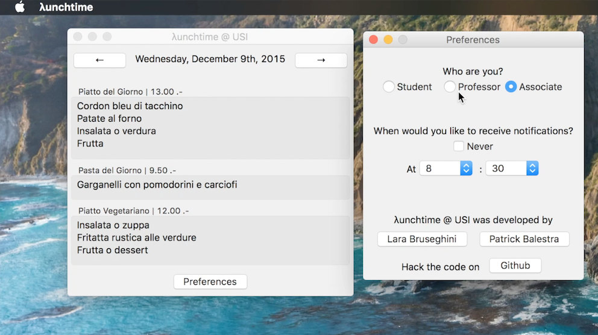
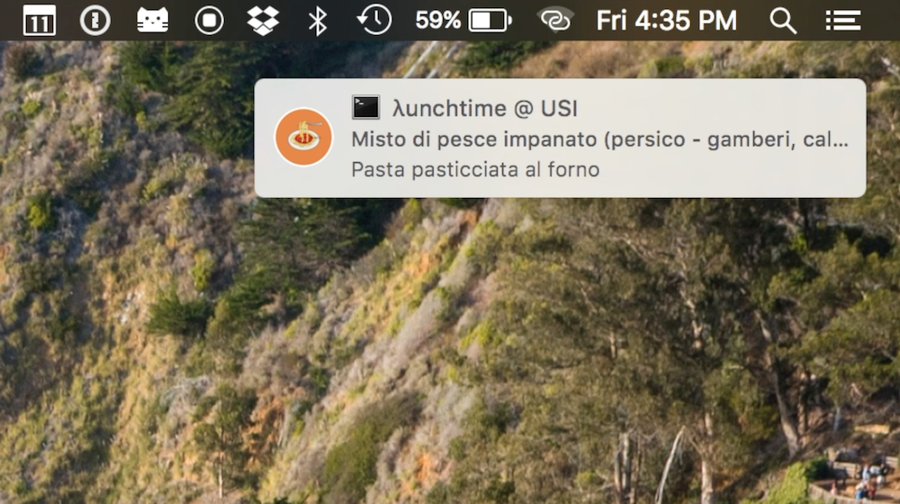

# λunchtime @ USI

Browse the [USI](http://www.inf.usi.ch)'s canteen menu with a single app and manage your preferences.

Get notified about the daily menu.

## Installation
You have to install a few dependencies in order to build the project successfully. To run the project, open the `λunchtime.rkt` file and run it.

* Make sure you have [DrRacket 6.3](http://racket-lang.org) installed on your machine.
* Install [poppler](http://poppler.freedesktop.org) library which is used to do a basic parsing of a PDF by doing `brew install poppler`
* Install [terminal-notifier](https://github.com/julienXX/terminal-notifier) to display notifications on your Mac by doing `brew install terminal-notifier`
* Install the [racket-poppler](https://github.com/soegaard/racket-poppler) library through the package manager. Go to `File > Install Package`. Press Browse and then the Directory button. Select the `racket-poppler` folder in the project directory and press Update. 

## Implementation Details
* **λunchtime.rkt** Program launcher.
* **ui.rkt** GUI definition.
* preferences.rkt Manages notifications (through a .plist file) and stores preferences set with the GUI.
* **parser.rkt** Core module, runs the bash scripts to convert the menu PDF into TXT and then parses it, extracting the different days’ menus and courses. 
* **date-checker.rkt** Determines each day’s date and whether the local menu is out of date, so that a new one is downloaded.
* **configuration.rkt** Used to determine the absolute paths of the resource files, as with the executable they need to be placed inside it.
* **scripts/download.sh** Downloads the PDF menu and converts it to TXT format. 
* **scripts/check.sh** Extracts a rectangle of text for each day (used by parser.rkt to
determine where there are no/less meals).
* **scripts/notify.sh** Shows notification messages - it is run by the System Daemon service.

## Authors
This project was created by [Lara Bruseghini](http://atelier.inf.unisi.ch/~brusel/) and [Patrick Balestra](http://atelier.inf.unisi.ch/~balesp/)  as our final project for the Programming Fundamentals I course at [USI](http://www.inf.usi.ch).

# License
This project is licensed under the terms of the MIT license. See the LICENSE file.

> This project and all fastlane tools are in no way affiliated with Apple Inc. This project is open source under the MIT license, which means you have full access to the source code and can modify it to fit your own needs. All fastlane tools run on your own computer or server, so your credentials or other sensitive information will never leave your own computer. You are responsible for how you use fastlane tools.